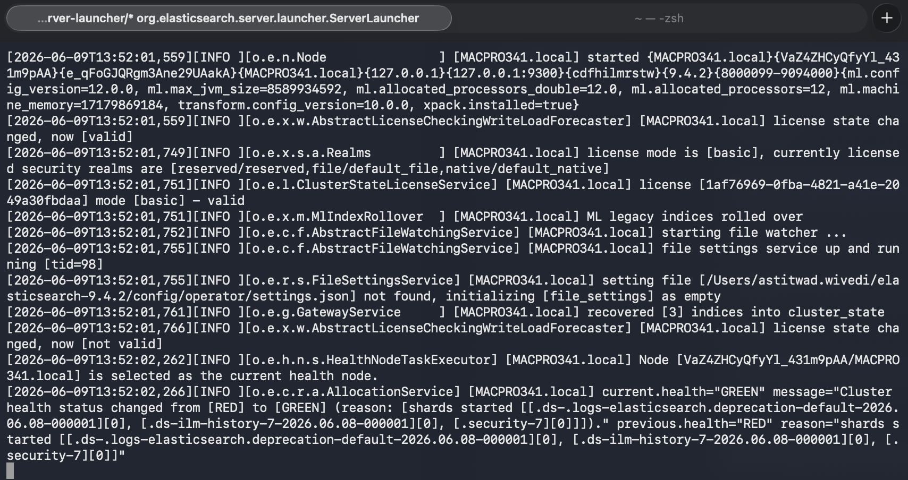
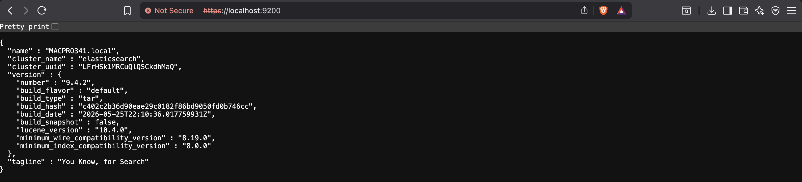
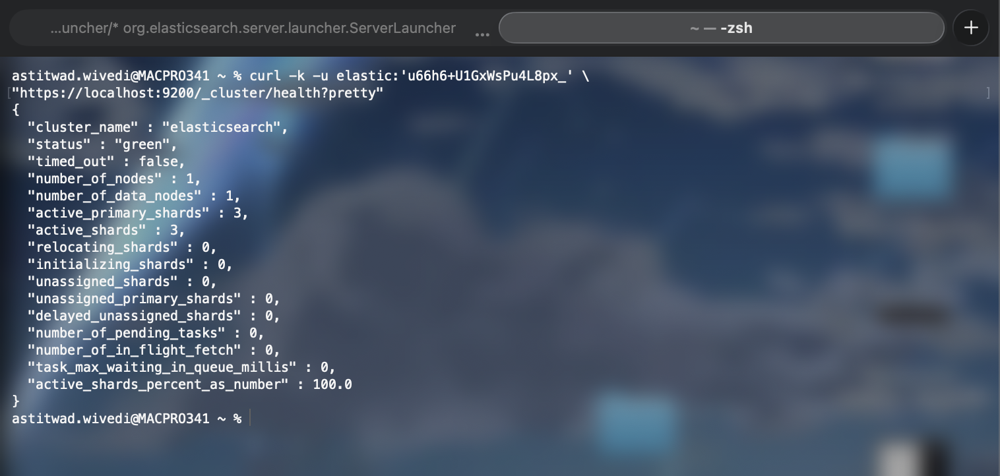
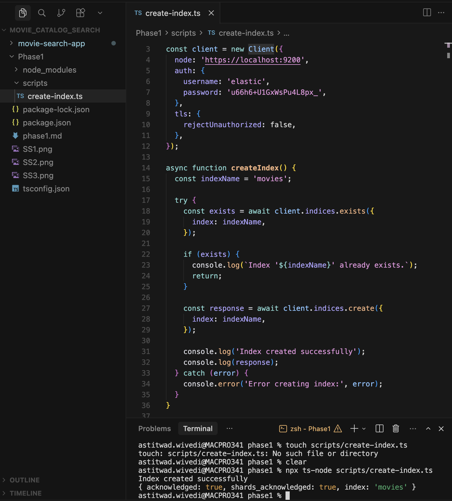
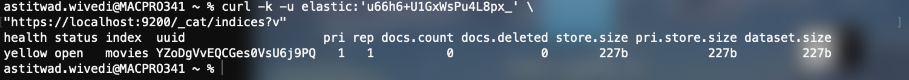

# Phase 1 - Elasticsearch Setup

## Overview

The objective of this phase was to install Elasticsearch locally, verify that the cluster was healthy, and create a dedicated index that will be used for the movie search application in later phases.

The setup was performed on macOS using the Elasticsearch tar distribution. Elasticsearch ships with a bundled JDK, so no separate Java installation was required.

---

## Environment Configuration

To make Elasticsearch commands available from any terminal session, the following environment variables were added to `~/.zshrc`.

```bash
export ELASTICSEARCH_HOME="$HOME/elasticsearch-9.4.2"
export PATH="$ELASTICSEARCH_HOME/bin:$PATH"
```

Reload the shell configuration:

```bash
source ~/.zshrc
```

Verify:

```bash
echo $ELASTICSEARCH_HOME
```

Expected output:

```text
/Users/<username>/elasticsearch-9.4.2
```

---

## Starting Elasticsearch

Elasticsearch was started from the installation directory using:

```bash
./bin/elasticsearch
```

After startup completed, the logs indicated that the node had joined the cluster and the cluster health became green.

Example log entries:

```text
Node started
current.health="GREEN"
```

### Screenshot



---

## Verifying Elasticsearch Availability

To verify that Elasticsearch was running and accepting requests:

```bash
curl -k https://localhost:9200
```

Since security was enabled, Elasticsearch responded with an authentication error instead of cluster information.

Example response:

```json
{
  "error": {
    "type": "security_exception",
    "reason": "missing authentication credentials"
  }
}
```

This confirmed that:

- Elasticsearch was running
- HTTPS was configured correctly
- Security was enabled

### Screenshot



---

## Verifying Cluster Health

Cluster health was verified using the Elasticsearch REST API.

```bash
curl -k -u elastic:<password> \
"https://localhost:9200/_cluster/health?pretty"
```

Example response:

```json
{
  "cluster_name": "elasticsearch",
  "status": "green"
}
```

A green cluster status indicates that all primary and replica shards are allocated successfully and the cluster is functioning normally.

### Screenshot



---

## Creating a Dedicated Index

A dedicated index named `movies` was created to store movie documents used throughout the project.

The index was created using a TypeScript script that uses the official Elasticsearch client.

### Script

File:

```text
scripts/create-index.ts
```

```typescript
import { Client } from '@elastic/elasticsearch';

const client = new Client({
  node: 'https://localhost:9200',
  auth: {
    username: 'elastic',
    password: '<password>'
  },
  tls: {
    rejectUnauthorized: false
  }
});

async function createIndex() {
  const indexName = 'movies';

  const exists = await client.indices.exists({
    index: indexName
  });

  if (!exists) {
    await client.indices.create({
      index: indexName
    });

    console.log(`Index '${indexName}' created successfully.`);
  } else {
    console.log(`Index '${indexName}' already exists.`);
  }
}

createIndex().catch(console.error);
```

### Running the Script

```bash
npm run create-index
```

or

```bash
npx ts-node scripts/create-index.ts
```

### Screenshot



---

## Verifying Index Creation

After running the script, the available indices were listed using:

```bash
curl -k -u elastic:<password> \
"https://localhost:9200/_cat/indices?v"
```

Expected output:

```text
health status index
green  open   movies
```

This confirmed that the `movies` index had been created successfully.

### Screenshot



---

## Project Structure

```text
Phase1/
├── node_modules/
├── scripts/
│   └── create-index.ts
├── package.json
├── package-lock.json
├── tsconfig.json
├── phase1.md
├── SS1.png
├── SS2.png
├── SS3.png
├── SS4.png
└── SS5.png
```

---

## Challenges Faced

### 1. Elasticsearch Password Was Lost

After enabling security, Elasticsearch required authentication for every API request.

Initially, requests such as:

```bash
curl -k https://localhost:9200
```

returned:

```json
{
  "error": {
    "type": "security_exception",
    "reason": "missing authentication credentials"
  }
}
```

At first it appeared that Elasticsearch was not working correctly, but the actual issue was that the password for the `elastic` user had not been saved during setup.

### 2. HTTP vs HTTPS Confusion

Several requests failed because Elasticsearch was configured to use HTTPS while some commands were executed using HTTP.

Example:

```bash
curl http://localhost:9200
```

This resulted in:

```text
Empty reply from server
```

The issue was resolved by switching to HTTPS:

```bash
curl -k https://localhost:9200
```

### 3. Password Reset Difficulties

The password reset utility initially failed because Elasticsearch was not running when the command was executed.

After verifying that the cluster was healthy and running, the password was reset successfully and the generated password was used for all subsequent API calls.

---

## Deliverables

### Setup Documentation

- Elasticsearch installation completed
- Environment variables configured
- Elasticsearch node started successfully
- Cluster health verified

### Screenshots

- SS1 – Elasticsearch startup logs
- SS2 – Elasticsearch running and responding
- SS3 – Cluster health verification
- SS4 – Index creation script and execution
- SS5 – Index verification

### Scripts

- `scripts/create-index.ts`

---

## Outcome

Elasticsearch was successfully installed and configured on a local machine. The cluster reached a healthy state, authentication was configured successfully, and a dedicated `movies` index was created for the next phases of indexing, searching, ranking, and analytics.
